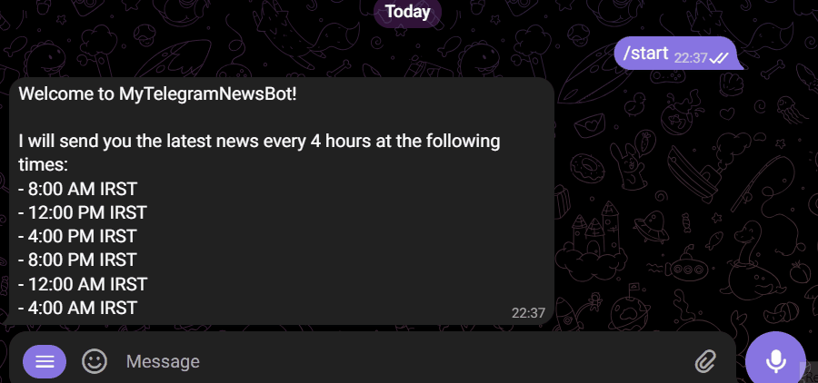

# 🤖 NewsReaderBot (نسخه ۲.۰)

⚠️ توجه: این ربات هنوز منتشر نشده و در حال توسعه است. به‌محض آماده‌سازی، لینک دسترسی به ربات در همین صفحه قرار خواهد گرفت.

## 🧭 معرفی

یک ربات تلگرام هوشمند برای دریافت اخبار شخصی‌سازیِشده از [NewsAPI.org](https://newsapi.org/).  نسخهِ 2.0 معرفیِ سازوکار موضوع/منبع هرمی و رابط کاربریِ تعاملی دو مرحله‌ای و مدیریت پیشرفتهِ ترجیحات را فراهم می‌کند.

---

## 🌟 ویژگی‌های کلیدی

* دریافت اخبار مرتبط با **موضوعات دلخواه کاربر**
* امکان **انتخاب منابع خبری** معتبر مانند CNN، BBC، NYTimes، و...
* رابط کاربری تعاملی با **دکمه‌های دو سطحی** برای مدیریت ترجیحات
* دسته‌بندی موضوعات و منابع به صورت گروهی و قابل پیمایش
* **پشتیبانی کامل از زبان فارسی و انگلیسی** با حفظ زبان در تمام بخش‌ها
* فیلتر اخبار به زبان انگلیسی
* پشتیبانی از **SQLAlchemy ORM** و **مهاجرت پایگاه داده با Alembic**
* **اسکریپت‌های نصب و تست خودکار** برای سهولت راه‌اندازی
* معماری مقیاس‌پذیر و قابل گسترش

---
## 🧱 ساختار پایگاه داده

| جدول           | شرح                                             |
| -------------- | ----------------------------------------------- |
| `users`        | اطلاعات کاربران (شناسه، نام، فعالیت اخیر و...)  |
| `user_topics`  | ترجیحات موضوعی کاربران (با دسته‌بندی)           |
| `user_sources` | ترجیحات منابع خبری برای هر کاربر (فعال/غیرفعال) |

---

## 🗂 دسته‌بندی موضوعات و منابع خبری

### 🧠 دسته‌های موضوعی

| گروه اصلی        | نمونه موضوعات                      |
| ---------------- | ---------------------------------- |
| فناوری و دیجیتال | AI، Programming، Cybersecurity     |
| علم و آموزش      | Science، Health، Space             |
| سیاست و اقتصاد   | Politics، Economy، Business        |
| فرهنگ و رسانه    | Movies، Music، Entertainment       |
| اجتماع           | Human Rights، Society، Immigration |
| ورزش و بازی      | Football، Sports، Gaming           |
| منطقه‌ای         | Iran News، US News، Middle East    |

### 🌐 دسته‌های منابع خبری

| گروه منابع          | نمونه وب‌سایت‌ها                    |
| ------------------- | ----------------------------------- |
| بین‌المللی          | CNN, BBC, NYTimes, Reuters          |
| فناوری              | The Verge, TechCrunch, WIRED        |
| سیاست آمریکا        | Politico, Fox News, NBC             |
| خاورمیانه (English) | Al-Monitor, Arab News, Tehran Times |
---
### 🧰 پیش‌نیازها

* Python 3.8 یا بالاتر
* ساخت ربات در [BotFather](https://t.me/BotFather)
* دریافت API Key از [NewsAPI](https://newsapi.org/)
* Git (برای کلون کردن پروژه)

---

### ⚙️ نصب و راه‌اندازی

#### روش ۱: نصب خودکار (توصیه شده)

```bash
# کلون کردن پروژه
git clone <repository-url>
cd NewsReaderBot

# اجرای اسکریپت نصب خودکار
python setup.py
```

اسکریپت `setup.py` به صورت خودکار:
- ✅ بررسی نسخه Python
- 📦 نصب کتابخانه‌های مورد نیاز
- 🔐 ایجاد فایل `.env` با تنظیمات پیش‌فرض
- 🗄️ راه‌اندازی پایگاه داده
- 🧪 تست اتصال پایگاه داده

#### روش ۲: نصب دستی

```bash
# نصب کتابخانه‌ها
pip install -r requirements.txt

# کپی کردن فایل نمونه محیط
cp env.template .env

# ویرایش فایل .env با کلیدهای API
# API_KEY=کلید_API_شما
# BOT_TOKEN=توکن_ربات_شما
# DATABASE_URL=sqlite:///newsreader.db

# راه‌اندازی پایگاه داده
python -m alembic upgrade head

# تست پایگاه داده
python test_db.py
```

#### 🚀 اجرای ربات

```bash
# اجرای ربات (توصیه شده برای تولید)
python main.py

```
---
## 📱 دستورات ربات
| دستور      | عملکرد                              |
| ---------- | ----------------------------------- |
| `/start`   | شروع و ثبت نام کاربر                |
| `/help`    | نمایش راهنمای دستورات               |
| `/news`    | دریافت اخبار شخصی‌سازی‌شده          |
| `/topics`  | مدیریت موضوعات خبری (دسته‌بندی شده) |
| `/sources` | مدیریت منابع خبری (دسته‌بندی شده)   |
| `/info`    | نمایش ترجیحات فعلی                  |
| `/language`| تغییر زبان ربات (فارسی/انگلیسی)     |

---
## 📸 نمونه رابط کاربری



---
### 🧪 تست و عیب‌یابی

#### تست پایگاه داده
```bash
python test_db.py
```

این اسکریپت موارد زیر را تست می‌کند:
- 🔌 اتصال پایگاه داده
- 👤 عملیات کاربر (ایجاد، بازیابی، به‌روزرسانی)
- 📰 عملیات منابع خبری
- 📚 عملیات موضوعات
- 🌐 مدیریت زبان
- ⚙️ ترجیحات کاربر
- 📂 سیستم دسته‌بندی

#### عیب‌یابی مشکلات رایج

**مشکل اتصال شبکه:**
```bash
# بررسی تنظیمات فایروال
# اطمینان از دسترسی به اینترنت
# بررسی کلیدهای API
```

**مشکل پایگاه داده:**
```bash
# پاک کردن و بازسازی پایگاه داده
rm newsreader.db
python -m alembic upgrade head
python test_db.py
```

**مشکل زبان:**
- ربات از زبان‌های فارسی و انگلیسی پشتیبانی می‌کند
- زبان انتخاب شده در تمام بخش‌ها حفظ می‌شود

---


### 🔄 مهاجرت از نسخه قدیمی

#### مرحله ۱: پشتیبان‌گیری
```bash
# پشتیبان‌گیری از دیتابیس قدیمی
cp subscribers.db subscribers_backup.db
```

#### مرحله ۲: نصب وابستگی‌های جدید
```bash
# نصب کتابخانه‌های جدید
pip install sqlalchemy alembic python-dotenv

# یا استفاده از اسکریپت نصب خودکار
python setup.py
```

#### مرحله ۳: راه‌اندازی پایگاه داده جدید
```bash
# اجرای مهاجرت‌های پایگاه داده
python -m alembic upgrade head

# تست پایگاه داده جدید
python test_db.py
```

#### مرحله ۴: راه‌اندازی مجدد
```bash
# اجرای ربات با ساختار جدید
python main.py
```

#### مرحله ۵: تست عملکرد
- ارسال `/start` توسط کاربران
- بررسی عملکرد زبان‌های فارسی و انگلیسی
- تست مدیریت موضوعات و منابع

---


<!-- * 📬 [ربات تلگرام پروژه](https://t.me/News_AriaBot) -->


## 🛡 مجوز

این پروژه تحت مجوز MIT منتشر شده است.

[MIT LICENSE](LICENSE) 
Copyright (c) 2025 Aria Aramesh

