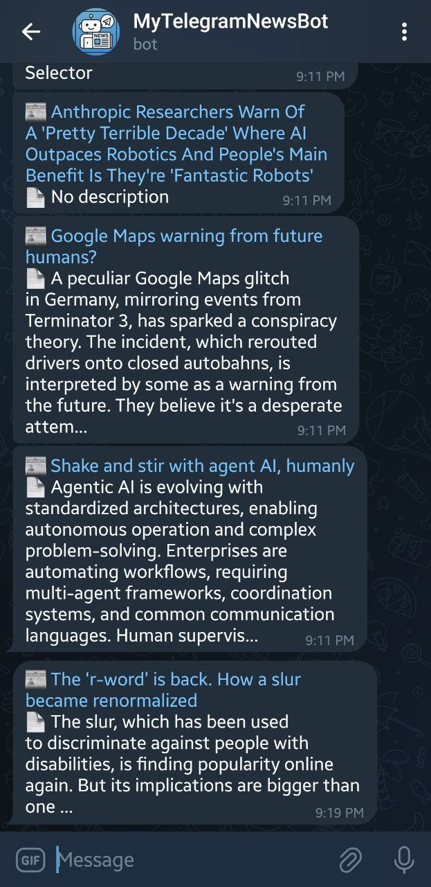

# 🤖 NewsReaderBot

> ⚠️ **توجه:** این ربات هنوز لایو نشده است و تنها در مراحل توسعه قرار دارد. به محض آماده‌سازی، لینک دسترسی به ربات در این صفحه منتشر خواهد شد.

پروژه‌ای ساده و هوشمند با پایتون برای دریافت اخبار جدید از [NewsAPI.org](https://newsapi.org/) و ارسال خودکار آن‌ها از طریق **ربات تلگرام** به کاربران علاقه‌مند. این پروژه قابل زمان‌بندی با GitHub Actions است تا بدون نیاز به اجرا توسط کاربر، اخبار را به‌صورت منظم ارسال کند.

---


## 📦 ویژگی‌ها

* دریافت اخبار مرتبط با کلیدواژه‌های منتخب (فناوری، برنامه‌نویسی، سیاست، سرگرمی، ورزش)
* تمرکز بر اخبار مربوط به ایران و آمریکا
* فیلتر اخبار به زبان انگلیسی از منابع معتبر (CNN, BBC, NYTimes, The Verge و...)
* ارسال خودکار به همه کاربرانی که `/start` را به ربات فرستاده‌اند
* ذخیره کاربران در فایل `subscribers.txt`
* ارسال پیام با فرمت Markdown
* ساختار شی‌گرای ماژولار و قابل گسترش

---

## 🧰 پیش‌نیازها

* Python 3.8+
* ایجاد ربات در [BotFather](https://t.me/BotFather)
* دریافت API Key از [NewsAPI.org](https://newsapi.org/)

---

## 🔧 نصب و اجرا

```bash
# نصب پیش‌نیازها
pip install -r requirements.txt

# تنظیم فایل .env
# ساخت فایل .env در ریشه پروژه با محتوای:
API_KEY=کلید_شخصی_شما
BOT_TOKEN=توکن_ربات_شما

# اجرای دستی اسکریپت
python src/main.py
```

---


## 📸 نمونه پیام ربات



---

## ⏰ اجرای زمان‌بندی‌شده (اختیاری)

در ادامه می‌توان با GitHub Actions فایل `news_reader.py` را به‌صورت زمان‌بندی‌شده (مثلاً هر 4 ساعت) اجرا کرد و به کاربران اطلاع‌رسانی کرد.

---

## 🛡 License

این پروژه تحت لایسنس MIT منتشر شده است. جزئیات کامل در فایل [LICENSE](LICENSE) موجود است.

```
MIT License
Copyright (c) 2025 Aria Aramesh
```

---

## 🙌 توسعه‌دهنده

* 👤 Aria Aramesh
<!-- * 📬 [ربات تلگرام پروژه](https://t.me/News_AriaBot) -->
